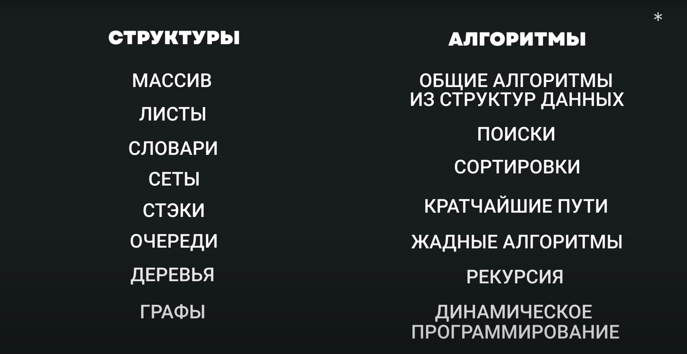
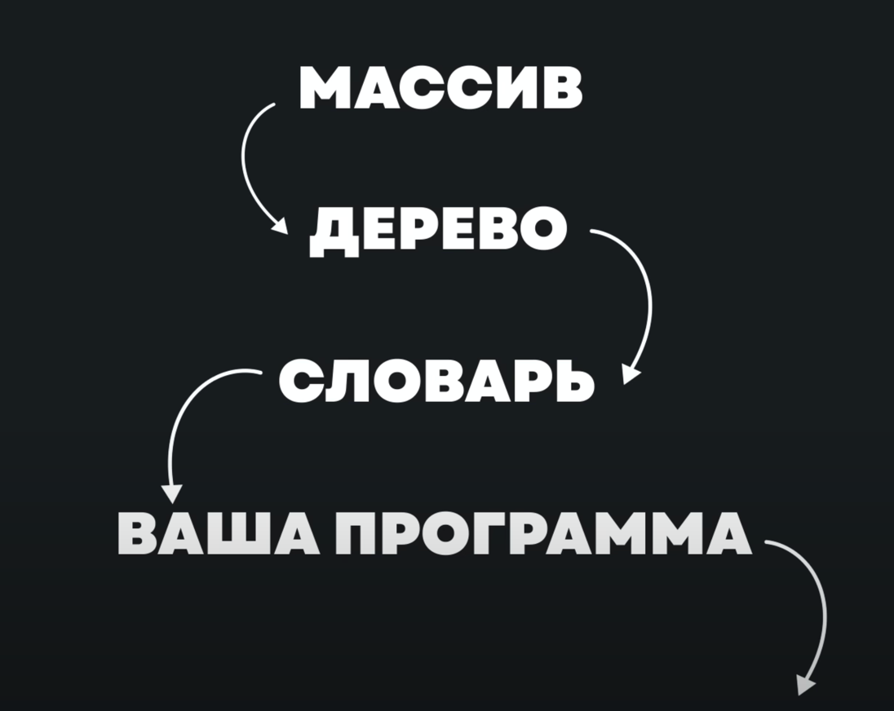

# Алгоритмы и структуры данных

**Algorithm + Data Structures = Programs**

## Структура данных

**Структура данных (англ. data structure) — программная единица, позволяющая хранить и обрабатывать множество однотипных
и/или логически связанных данных в вычислительной технике. Для добавления, поиска, изменения и удаления данных структура
данных предоставляет некоторый набор функций, составляющих её интерфейс.**

- Статический массив
- Динамический массив (aka Vector aka list)
- Ассоциативный массив (aka HashMap)

## Алгоритм

**Алгоритм — конечная совокупность точно заданных правил решения некоторого класса задач или набор инструкций,
описывающих порядок действий исполнителя для решения некоторой задачи.**

- [Алгоритмическая трасса](https://github.com/trekhleb/javascript-algorithms/blob/master/README.ru-RU.md)
- [Codewars](www.codewars.com/r/TstSuw)

## Программа

Ремесло программиста - превращать описание задачи в готовый алгоритм. На любом уровне

[Самообучение](https://github.com/ilmoi/teachyourselfCS-RU/blob/master/Teach_yourself_cs-2020-RU.md)
