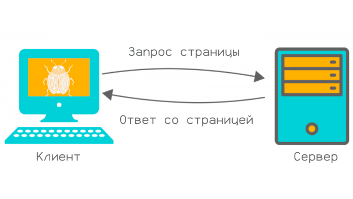
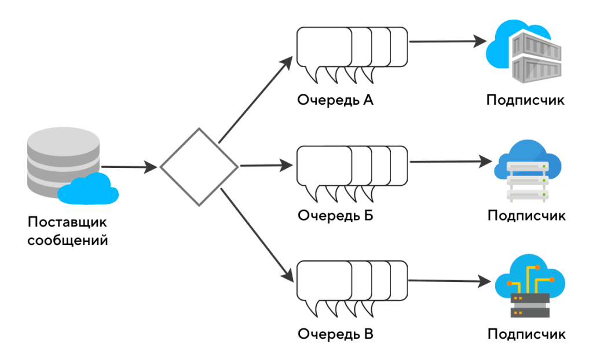
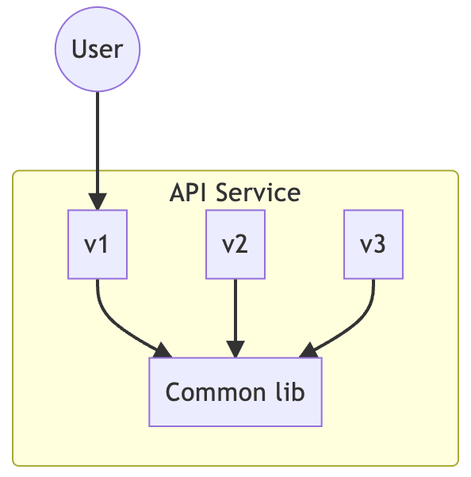
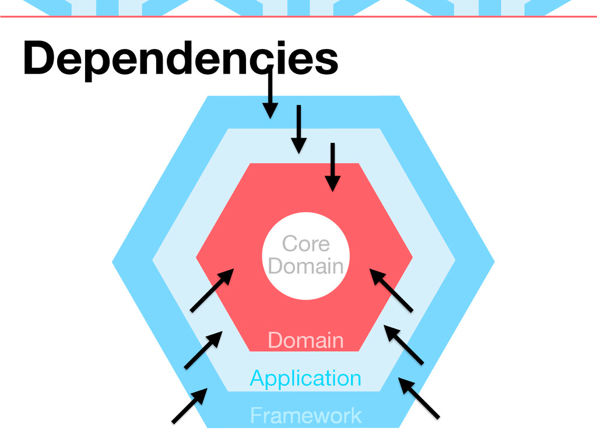
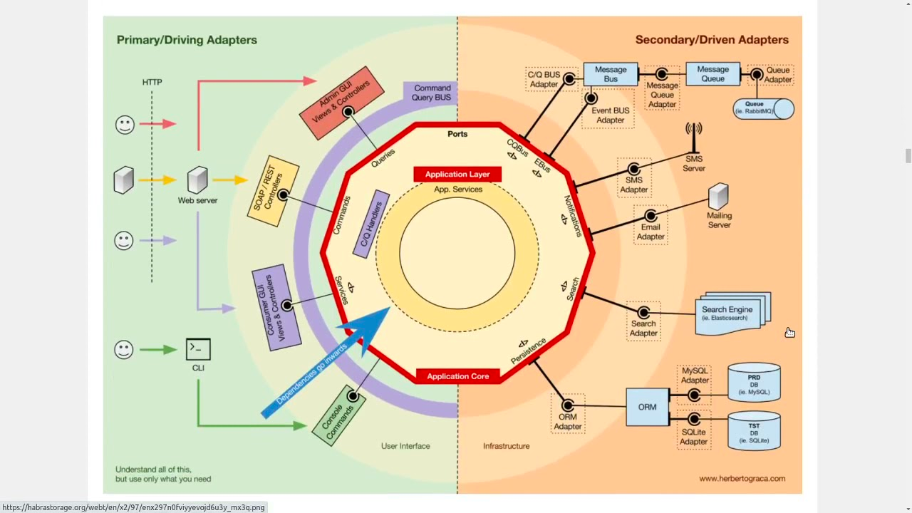
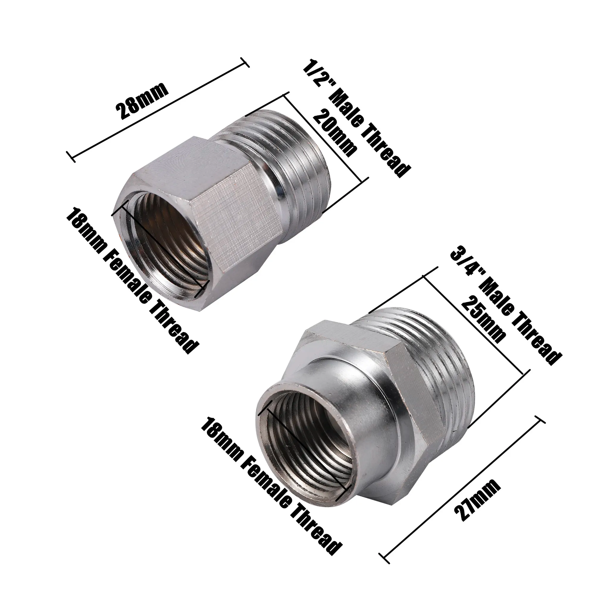

# Интеграция программных систем

## Что такое интеграция?

> Интегра́ция (от лат. integratio — «восстановление», «восполнение», «соединение») — процесс объединения частей в целое.

- Клиент-Сервер
- Источник
- Сервис
- Мастер система (буква S)

## Протокол обмена

- Контрактное программирование
  
- Варианты связей
    - Системный вызов
    - shared-resource
    - http
    - Очереди
      

## Готовность приложения к интеграции

- Версионность API

- Документация
- Специализированные методы (буква I)
- Поддержка нескольких протоколов (буква D)

- Deprecated возможности
- Обратная совместимость

## Модели и данные

- Валидация
- Паттерн Адаптер
  
- Расширение (буква О)
- ACL

## Согласованность изменений

- Транзакции
- Outbox